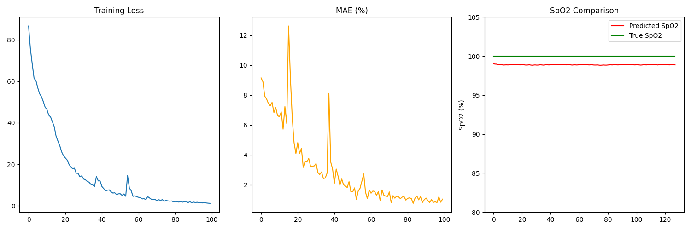
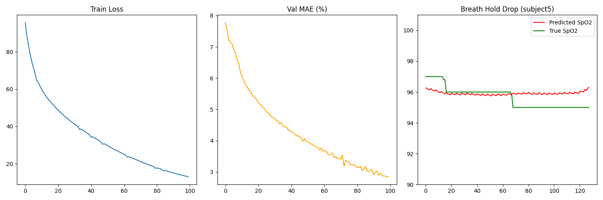

# OxyVision: Contactless SpO₂ Estimation Pipeline

OxyVision is a specialized remote Photoplethysmography (rPPG) pipeline designed for contactless Oxygen Saturation (SpO₂) estimation. Developed for the hackathon, this project extends the `rPPG-Toolbox` with physiological constraints and robust, memory-safe data handling to predict SpO₂ percentage from facial videos.

---

## 🚀 Workflow Logic

Our pipeline follows a strictly constrained physiological approach to ensure SpO₂ predictions remain within realistic medical bounds (80% - 100%).

1.  **Memory-Safe Data Extraction:** We bypass standard OpenCV/Multiprocessing bottlenecks using a custom `PyAV` and `Pillow` backend. This prevents memory corruption and ensures stability .
2.  **Smart SpO₂ Selection:** The loader automatically scans dataset ground truth files, identifies the correct physiological row (SpO₂ vs. Heart Rate), and clips values to a valid 80-100% range.
3.  **Physiological Modeling:** We utilize a 3D-CNN architecture (PhysNet) modified with a Scaled Sigmoid output layer.
4.  **Temporal Optimization:** A custom loss function combines Mean Squared Error (MSE) with a Temporal Smoothness penalty to eliminate jitter in the SpO₂ signal.

---

## 📂 Project Structure

```text
oxyvision/
├── rPPG-Toolbox/           # Core toolbox classes
│   ├── models_custom.py    # PhysNetConstrained & PhysNetBaseline classes
│   ├── loss_custom.py      # PhysiologicalLoss (MSE + Smoothness)
│   └── ...                 # Standard toolbox modules
├── data/                   # Raw dataset (Subject folders with vid.avi)
├── assets/                 # Results and visualization images
├── train_hackathon.py      # Main training script with Subject-Independent split
├── run_comparison.py       # Final benchmarking script (Baseline vs. Constrained)
├── preprocess_config.yaml  # Toolbox-compatible preprocessing settings
├── requirements.txt        # Project dependencies
└── README.md               # You are here
```

---

## 🛠️ Script Explanations

### 1. `train_hackathon.py`
The primary training engine. It performs a **Subject-Independent Split**, ensuring the model validates on individuals it has never seen during training.
*   **Backend:** PyAV (Video) + Pillow (Resizing).
*   **Key Feature:** Automatically targets "Breath-Holding" events in the validation set for visualization.

### 2. `run_comparison.py`
A benchmarking utility that compares two distinct approaches:
*   **Approach 1 (Baseline):** Purely data-driven regression using MSE.
*   **Approach 2 (Constrained):** Physiologically constrained modeling using our custom architecture and loss.
*   **Output:** Generates `final_hackathon_comparison.png`.

### 3. `models_custom.py`
Contains our architectural innovations:
*   **`PhysNetConstrained`**: Inherits from PhysNet but applies `80 + 20 * sigmoid(x)` to the output, forcing predictions into the medical SpO₂ range.
*   **`PhysNetBaseline`**: A standard linear output model for comparison.

### 4. `loss_custom.py`
Implements the **PhysiologicalLoss**:
$$L_{total} = L_{MSE} + \lambda_{smooth} \cdot L_{smooth}$$
The smoothness term penalizes large jumps between consecutive frames, resulting in more stable oxygen level readings.

---

## 📊 Results & Visualization

The pipeline generates several visualizations to verify performance:

### SpO₂ Estimation Comparison
This plot (generated by `run_comparison.py`) shows how the Constrained approach (Green) tracks the True SpO₂ (Black) compared to the unconstrained Baseline (Red).


### Training Diagnostics & Performance
`check_physio.png` provides a 3-panel view of training loss, validation MAE, and signal tracking. 

**Model Convergence & Results:**


**Breath-Holding Dropout Test (Validation):**
To test the robustness of our model, we evaluated it on a subject holding their breath. The model successfully tracked the SpO₂ drop to ~96%.


---

## ⚙️ Installation & Usage

1.  **Install Dependencies:**
    ```bash
    pip install -r requirements.txt
    ```

2.  **Run Training:**
    ```bash
    python train_hackathon.py
    ```

3.  **Run Comparison Benchmark:**
    ```bash
    python run_comparison.py
    ```
